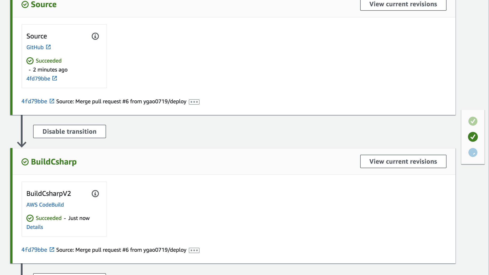
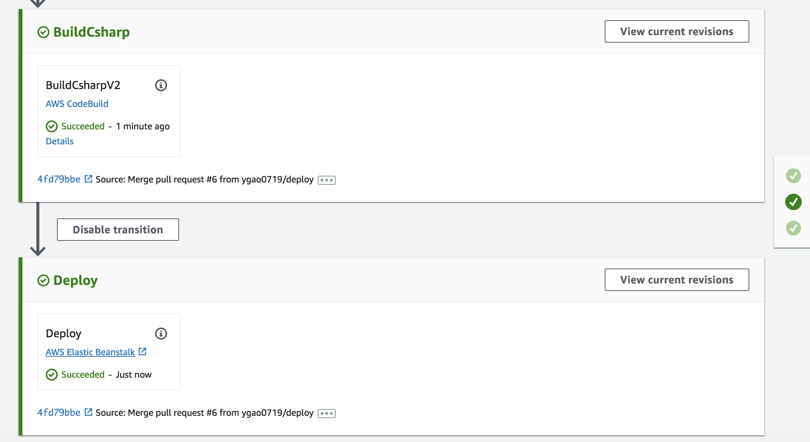
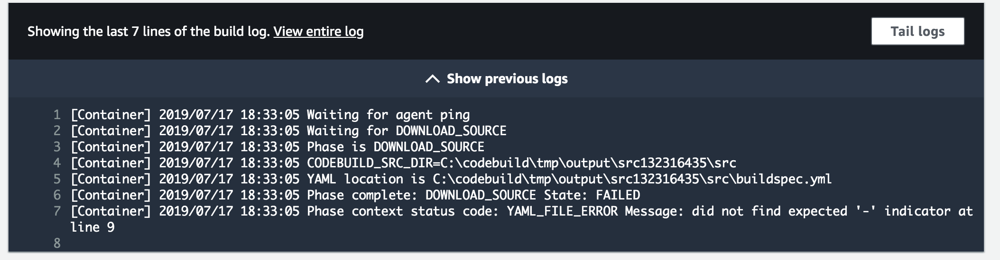

# Code Pipeline for C#
## Files for the C# Application folder
1. Add buildspec.yml file. Make sure the YML file is validated by using www.yamllint.com. SPACE MATTERS.
```
version: 0.2

phases:

  build:
    commands:
      - dotnet restore deployment-app-csharp/basic-web-app/basic-web-app.csproj
      - dotnet build deployment-app-csharp/basic-web-app/basic-web-app.csproj
      - dotnet publish deployment-app-csharp/basic-web-app/basic-web-app.csproj -o site
artifacts:
  files:
    - deployment-app-csharp/site/**/*
    - deployment-app-csharp/aws-windows-deployment-manifest.json
```
2. Add aws-windows-deployment-manifest.json file
```

{
  "manifestVersion": 1,
  "deployments": {
      "aspNetCoreWeb": [{
              "name": "deployment-app-csharp",
              "parameters": {
                  "appBundle": "./basic-web-app/site",
                  "iisPath": "/",
                  "iisWebSite": "Default Web Site"
              }
          }
      ]
  }
}
```
To see more details, check out: https://github.com/nguyenvinh2/deployment-app-csharp

## Setting up pipeline in AWS:
1. Click create pipeline in CodePipeline
2. On pipeline settings, enter pipeline name. Click next.
3. Under source provider, select Github and connect to github. Enter credentials. 
4. Select repository and master branch, then click next.
5. Skip Build stage. Click Skip to confirm.
6. Under Deploy provider, select Elastic Beanstalk (Ensure EB is already set-up). Select corresponding application and environment names. Click next.
7. Click Create Pipeline. Wait for confirmation.

## Deployed Link
[link](http://deploycsharpappenv-env.wmp3upeg2i.us-west-2.elasticbeanstalk.com/)

## Code Build
+ Add Code Build -> 'Create new Build Stage'
    + Choose windows environment
    + Choose Use your Own (make sure yml file is at root of your Git repo)
    
    

    ### Blockers
   
    + **SPACES ARE VERY SPECIFIC AND SENSITIVE!!!** -> 2 spaces for an indent
        + YAML LINT will verify if spacing is correct
        
